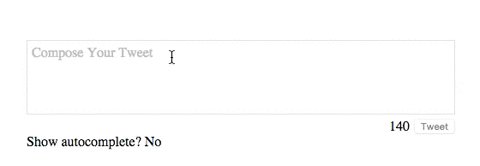

# React-Wysiwyg



This component allows you to have input field like behaviour while using contenteditable. This is especially useful if you want to perform in-place, wysiwyg editing. It comes with support for placeholders and max-length validation.

I've currently tested this in Firefox, Chrome, Safari (desktop & mobile), and IE 9-11.

## Install

```
$ npm install react-wysiwyg
```

## Usage

```javascript
var ContentEditable = require('react-wysiwyg');

var Example = React.createClass({
  
  getInitialState: {
    text: '',
    editing: false
  },

  render: function(){
    return (
      <div>
        <ContentEditable
          tagName='div'
          className='name-field'
          onChange={this.onChange}
          onEnterKey={this.onSave}
          onEscapeKey={this.onCancel}
          text={this.state.text}
          placeholder='Your Name'
          autoFocus={true}
          maxLength={200}
          editing={this.state.editing}
        />
        <button onClick={this.enableEditing}>
          Enable Editing
        </button>
      </div>
    );
  },

  onSave: function() {
    // logic to save this.state.text here
    this.replaceState(this.getInitialState())
  },

  onCancel: function() {
    this.replaceState(this.getInitialState())
  },

  onChange: function(text) {
    // in order to render the updated text,
    // you need to pass it as a prop to contentEditable.
    // This gives you increased flexibility.
    this.setState({ text: text });
  },

  enableEditing: function(){
    // set your contenteditable field into editing mode.
    this.setState({ editing: true });
  }

});
```

## Tests

```
make test
```
